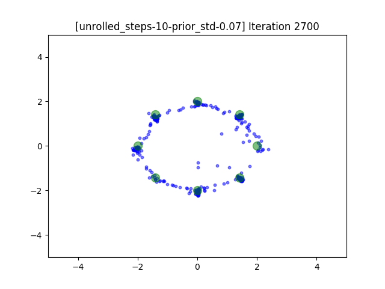
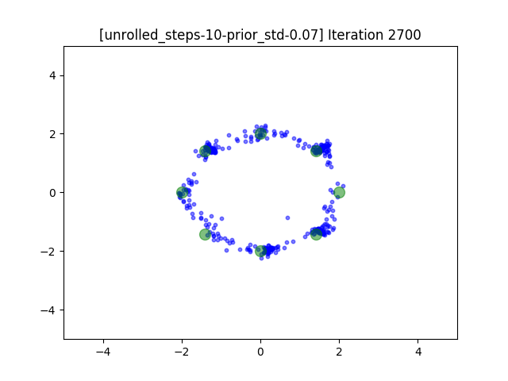

# pytorch unrolled gan
This repository implements UNROLLED GENERATIVE ADVERSARIAL NETWORKS (https://arxiv.org/pdf/1611.02163.pdf).

# Install
```
docker pull pytorch/pytorch:1.3-cuda10.1-cudnn7-devel
pip install -r requirements.txt
git clone git@github.com:facebookresearch/higher.git
cd higher
pip install .

```

# Run
You can run unrolled gan with 10 steps using the following code. 
```
python main.py --config yes_higher_unroll_10
```
- `yes_higher_unroll_10` uses higher library to create gradient of gradient. 
- `no_higher_unroll_10` option is to show what happens if the gradient is only first order approximation.  
- `unroll_0` option does not unroll gradient at all (simple GAN). 

All running script provided in `run.sh`
```sh
run.sh
```

# Result

unroll_0___________           |  no_higher_unroll_10_ | yes_higher_unroll_10
:-------------------------:|:-------------------------:|:-------------------:
 |  |   | 


# Caveats

This implementation is based on another implementation of unrolled gan https://github.com/andrewliao11/unrolled-gans.
The reason for the reimplementation is that the previous implementation did not unroll Discriminator's gradient,
but only used the simulated Discriminator as the new discriminator to update Generator. 

In this implementation, I used facebook's higher order gradient library higher https://github.com/facebookresearch/higher to create unrolled gradients.

